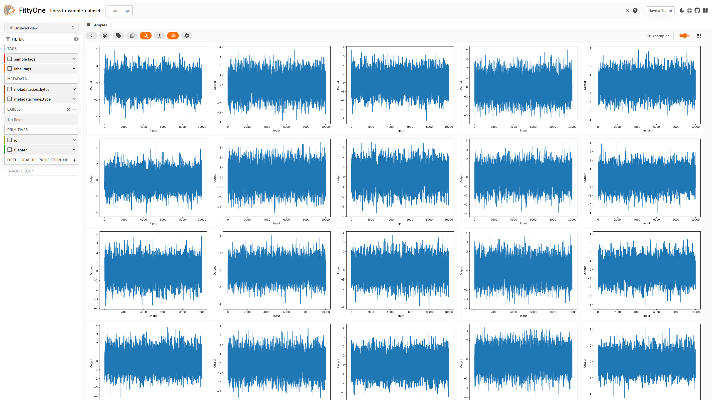
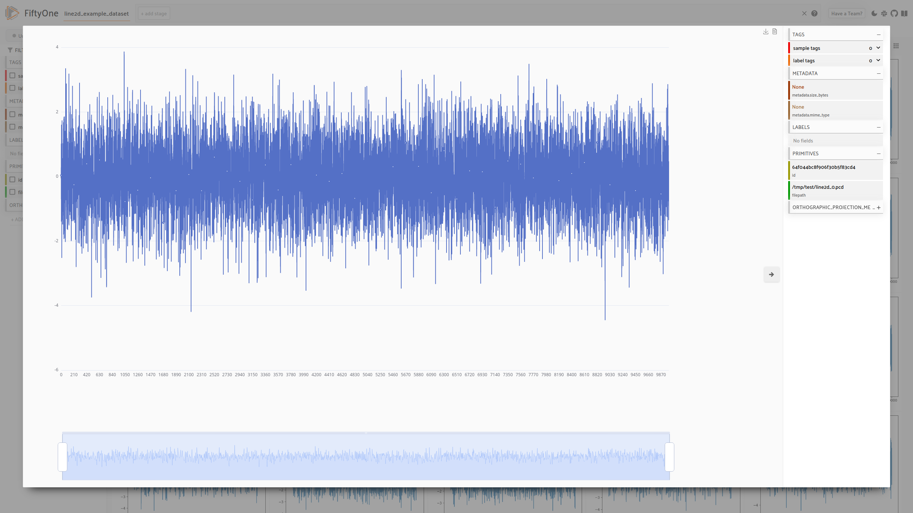

# Line 2D

| | |
| --- | --- |
|||

This plugin uses eCharts to visualize x,y-Points as a line chart.
For now the visualizer component can only be overwritte by a plugin if its filepath has an ".pcd"-extension.

So files has to be converted to be usable with this plugin. It expects json files with an ".pcd"-extension with `json["x"]` representing the x-coordinates and `json["y"]` the y-coordinates.

### Example file

```json
{"x": [0, 1, 2, 3], "y": [0.46, -0.20, 1.21, 0.69]}
```

In `LoadExampleData` in `__init__.py` you can see how data can be gernerated.

The plugin also adds two buttons "Genrate Thumbnails" and "Generate Example Dataset".

### Plugin Installation

To install the plugin, run the following command:

```shell
fiftyone plugins download https://github.com/wayofsamu/line2d
```

### Operators

### `line2d_example_dataset`

- Generate an example dataset at given path

### `line2d_thumbnails`

- Generate thumbnails into the same directory as the dataset files are
